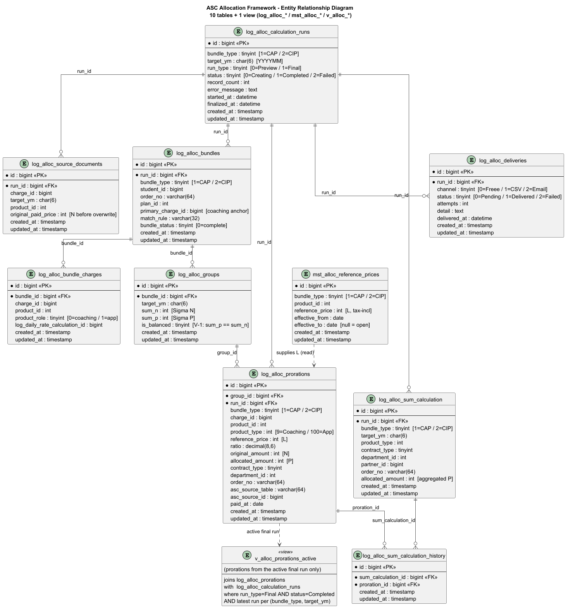

# ASC Allocation Framework — Database Schema Reference

## Document Info

| |                                                                                                                                                                                                                                                     |
|---|-----------------------------------------------------------------------------------------------------------------------------------------------------------------------------------------------------------------------------------------------------|
| **Document type** | Database Schema Reference                                                                                                                                                                                                                           |
| **Date** | 2026-09-01 (Created)                                                                                                                                                                                                                                |
| **Author** | Noel Palo, Lead Developer                                                                                                                                                                                                                           |
| **Assisted by** | Kiro                                                                                                                                                                                                                                                |
| **Status** | Active — schema source of truth for ASCA Spec 01 (Foundation)                                                                                                                                                                                       |
| **Audience** | Dev team (migrations in `ls-database-migrations`, models in `accounting_related_system_for_freee`), Kuroda-san (PM)                                                                                                                                 |
| **Based on** | [REF-CAP-04 (Kuroda-san's DB design)](../../../research/CAP/REF-CAP-04-ASC-Alloc-Framework-DB-Design-20260810.md), [Technical design](asc-allocation-framework-technical-design.md), [Table-prefix ADR](ASCA-ADR-20260817-table-prefix-decision.md) |

---

## Purpose

The complete field-level schema for the 10 allocation tables + 1 view. REF-CAP-04 (Kuroda-san) defines the table set and roles; this doc adds the **columns, data types, nullability, keys, and field descriptions** needed to write the migrations (Spec 01a) and models (Spec 01b).

## Conventions

- **Connection:** `mysql` (Bizmates) at runtime; `bizmates_mysql` in migrations. Bizmates-only — no Zipan.
- **Table prefixes (per ADR 2026-08-17):** `log_alloc_*` = batch-generated, `mst_alloc_*` = master data, `v_alloc_*` = view.
- **Money types:** reference prices (L) and paid amounts (N, P) = `INT` (yen), matching the existing `paid_price` column. Ratio = `DECIMAL(8,6)`.
- **Enum columns:** all `TINYINT`, mapped to int-backed PHP enums (`bundle_type`, `run_type`, `status`, `product_role`, `channel`, etc.). Values are `1`-based (`0` = unset). Human-readable strings come from the enum's `label()` method — never stored. Consistent with the existing accounting-system convention (status/type columns are int).
- **Standard columns:** every table has `id BIGINT UNSIGNED AUTO_INCREMENT PK`, `created_at`, `updated_at`. `deleted_at` only where soft-delete is needed.
- **Physical FKs:** allocation tables use real foreign keys between themselves (differs from the older `log_*` tables which have none).

---

## ⚠️ Proposal: `project_code` (VARCHAR) → `bundle_type` (TINYINT)

REF-CAP-04 named the CAP/CIP discriminator column `project_code`. **This doc proposes two changes** (pending Kuroda-san's OK):

1. **Rename** `project_code` → `bundle_type` — the column should reflect **what the data IS** (a CAP-type or CIP-type bundle), not **which project created it** (same principle as the table-prefix ADR).
2. **Retype** VARCHAR → **TINYINT** — for schema consistency with the other enum columns (`run_type`, `run_status`, etc. are all TINYINT). Stored as int (`1`=CAP, `2`=CIP); human-readable `'cap'`/`'cip'` comes from the `BundleType` enum's `label()` method for CSV/Metabase.

Until Kuroda-san confirms, this doc uses **`bundle_type` TINYINT** and notes the original (`project_code` VARCHAR) inline.

**Enum mapping:** `BundleType: int { CAP = 1; CIP = 2; }` with `label()` → `'cap'`/`'cip'`.

---

## Table Overview

| # | Table | Prefix | Role |
|---|---|---|---|
| 1 | `log_alloc_calculation_runs` | `log_` | Run lifecycle — one row per batch execution (preview/final) |
| 2 | `log_alloc_source_documents` | `log_` | Immutable snapshot of original N values before overwrite |
| 3 | `log_alloc_bundles` | `log_` | Bundle header — one detected Coaching+App pair per run |
| 4 | `log_alloc_bundle_charges` | `log_` | Products within a bundle (always 2 today: coaching + app) |
| 5 | `log_alloc_groups` | `log_` | One bundle × one month (ΣN, ΣP, is_balanced) |
| 6 | `log_alloc_prorations` | `log_` | **Core result** — one row per product per group (L, ratio, N, P) |
| 7 | `mst_alloc_reference_prices` | `mst_` | Allocation weights (L), effective-dated master data |
| 8 | `log_alloc_sum_calculation` | `log_` | Freee-level aggregation |
| 9 | `log_alloc_sum_calculation_history` | `log_` | Trace: summary row → proration rows |
| 10 | `log_alloc_deliveries` | `log_` | Freee/CSV/email delivery attempt tracking |
| 11 | `v_alloc_prorations_active` | `v_` | View — prorations from the active final run only |

---

## 1. `log_alloc_calculation_runs`

Run management. One row per batch execution. Persists even if the calculation fails (own commit), so failures are auditable.

| Column | Type | Null | Description |
|---|---|---|---|
| `id` | BIGINT UNSIGNED | NO | PK |
| `bundle_type` | TINYINT | NO | Enum `BundleType`: 1=CAP, 2=CIP — which bundle family this run processed. *(was `project_code` VARCHAR in REF-CAP-04 — rename+retype pending Kuroda-san)* |
| `target_ym` | CHAR(6) | NO | Target year-month, `YYYYMM` (e.g. `202701`) |
| `run_type` | TINYINT | NO | Enum `RunType`: 0=Preview, 1=Final |
| `status` | TINYINT | NO | Enum `RunStatus`: 0=Creating, 1=Completed, 2=Failed |
| `record_count` | INT | YES | Number of allocations processed (set on finalize) |
| `error_message` | TEXT | YES | Failure reason (set when status=Failed) |
| `started_at` | DATETIME | NO | When the run began |
| `finalized_at` | DATETIME | YES | When the run completed or failed |
| `created_at` / `updated_at` | TIMESTAMP | NO | Standard |

**Keys / rules:** V-5 — only one active final run per (`bundle_type`, `target_ym`). Enforced within transaction.

---

## 2. `log_alloc_source_documents`

Immutable snapshot of the original N (paid_price) values **before** allocation overwrites them. The audit proof of what the numbers were pre-allocation.

| Column | Type | Null | Description |
|---|---|---|---|
| `id` | BIGINT UNSIGNED | NO | PK |
| `run_id` | BIGINT UNSIGNED | NO | FK → `log_alloc_calculation_runs.id` |
| `charge_id` | BIGINT UNSIGNED | NO | FK to source `trn_charge.id` (logical) |
| `target_ym` | CHAR(6) | NO | Year-month of the snapshot |
| `product_id` | INT | NO | Product being snapshotted (coaching or app) |
| `original_paid_price` | INT | NO | The N value before overwrite (yen) |
| `created_at` / `updated_at` | TIMESTAMP | NO | Standard |

**Rule:** snapshot skip — do NOT insert if a row already exists for (`charge_id`, `target_ym`). Prevents recording already-allocated values as "original" on re-runs (technical design §9).

---

## 3. `log_alloc_bundles`

Bundle header — one row per detected Coaching+App pair per run.

| Column | Type | Null | Description |
|---|---|---|---|
| `id` | BIGINT UNSIGNED | NO | PK |
| `run_id` | BIGINT UNSIGNED | NO | FK → `log_alloc_calculation_runs.id` |
| `bundle_type` | TINYINT | NO | Enum `BundleType`: 1=CAP, 2=CIP *(was `project_code` VARCHAR)* |
| `student_id` | BIGINT UNSIGNED | NO | Student who owns the bundle |
| `order_no` | VARCHAR(64) | YES | Order number — part of the bundle grouping key |
| `plan_id` | INT | NO | The CAP/CIP plan_id (1016–1027 or 1028–1032) |
| `primary_charge_id` | BIGINT UNSIGNED | NO | The coaching charge (bundle anchor) |
| `match_rule` | VARCHAR(32) | NO | How the bundle was detected (e.g. `student_order_no`) |
| `bundle_status` | TINYINT | NO | 0=complete (coaching+app both present). Non-zero = incomplete (V-3 warning) |
| `created_at` / `updated_at` | TIMESTAMP | NO | Standard |

**Grouping key:** (`student_id`, `order_no`) — isolates each contract (handles cancel+repurchase, simultaneous plans).

---

## 4. `log_alloc_bundle_charges`

One row per product inside a bundle (always 2 today: coaching + app). Links individual charges to their bundle.

| Column | Type | Null | Description |
|---|---|---|---|
| `id` | BIGINT UNSIGNED | NO | PK |
| `bundle_id` | BIGINT UNSIGNED | NO | FK → `log_alloc_bundles.id` |
| `charge_id` | BIGINT UNSIGNED | NO | FK to `trn_charge.id` (logical) |
| `product_id` | INT | NO | Coaching (10005/10015/10025) or App (10022) |
| `product_role` | TINYINT | NO | 0=coaching, 1=app — which side of the split |
| `log_daily_rate_calculation_id` | BIGINT UNSIGNED | YES | The log row this charge maps to (the one overwritten) |
| `created_at` / `updated_at` | TIMESTAMP | NO | Standard |

---

## 5. `log_alloc_groups`

One bundle × one month. Holds the ΣN / ΣP totals and the balance check for validation V-1.

| Column | Type | Null | Description |
|---|---|---|---|
| `id` | BIGINT UNSIGNED | NO | PK |
| `bundle_id` | BIGINT UNSIGNED | NO | FK → `log_alloc_bundles.id` |
| `target_ym` | CHAR(6) | NO | The month this grouping covers |
| `sum_n` | INT | NO | ΣN — total original paid_price across the bundle (yen) |
| `sum_p` | INT | NO | ΣP — total allocated amount (must equal sum_n) |
| `is_balanced` | TINYINT(1) | NO | 1 if sum_p == sum_n (V-1). 0 blocks finalize |
| `created_at` / `updated_at` | TIMESTAMP | NO | Standard |

**Invariant V-1:** `sum_p == sum_n` per group. If not balanced, run cannot finalize.

---

## 6. `log_alloc_prorations`  ★ Core result table

One row per product per group. Stores the reference price (L), the ratio, the original N, and the allocated P. Drives CSV generation and the Metabase breakdown.

| Column | Type | Null | Description |
|---|---|---|---|
| `id` | BIGINT UNSIGNED | NO | PK |
| `group_id` | BIGINT UNSIGNED | NO | FK → `log_alloc_groups.id` |
| `run_id` | BIGINT UNSIGNED | NO | FK → `log_alloc_calculation_runs.id` |
| `bundle_type` | TINYINT | NO | Enum `BundleType`: 1=CAP, 2=CIP *(was `project_code` VARCHAR)* |
| `charge_id` | BIGINT UNSIGNED | NO | The charge this proration is for |
| `product_id` | INT | NO | Coaching or App product |
| `product_type` | INT | NO | Freee product_type (9=Coaching, 100=App) |
| `reference_price` | INT | NO | L — the allocation weight (yen) from `mst_alloc_reference_prices` |
| `ratio` | DECIMAL(8,6) | NO | This product's share of the weight total |
| `original_amount` | INT | NO | N — pre-allocation paid_price (yen) |
| `allocated_amount` | INT | NO | P — post-allocation paid_price (yen) |
| `contract_type` | TINYINT | YES | B2C/B2B/B2B2C/Partner (for CSV + Freee) |
| `department_id` | INT | YES | Department (for CSV + Freee) |
| `order_no` | VARCHAR(64) | YES | Order number |
| `asc_source_table` | VARCHAR(64) | NO | Which log table N was read from (`log_daily_rate_calculation[_pre]`) |
| `asc_source_id` | BIGINT UNSIGNED | NO | ID of the source row in that table |
| `paid_at` | DATE | YES | Snapshot of `trn_charge.paid_at` (date part) |
| `created_at` / `updated_at` | TIMESTAMP | NO | Standard |

**Formula:** `allocated_amount` (P) computed as `P_app = floor(N × L_app / (L_coaching + L_app))`, `P_coaching = N − P_app`.

---

## 7. `mst_alloc_reference_prices`  ★ Master data

Effective-dated allocation weights (L). Configurable without code changes.

| Column | Type | Null | Description |
|---|---|---|---|
| `id` | BIGINT UNSIGNED | NO | PK |
| `bundle_type` | TINYINT | NO | Enum `BundleType`: 1=CAP, 2=CIP *(was `project_code` VARCHAR)* |
| `product_id` | INT | NO | The product this price applies to |
| `reference_price` | INT | NO | L value (yen, tax-inclusive) |
| `effective_from` | DATE | NO | Start of validity |
| `effective_to` | DATE | YES | End of validity (NULL = open-ended) |
| `created_at` / `updated_at` | TIMESTAMP | NO | Standard |

**Seed values (per REF-CIP-04 + technical design):**

| bundle_type | product_id | reference_price | Note |
|---|---|---|---|
| 1 (cap) | 10022 (App) | 3980 | |
| 1 (cap) | 10005 (Coaching 15min) | 19800 | |
| 1 (cap) | 10015 (Coaching 30min) | 39600 | |
| 2 (cip) | 10022 (App) | 3980 | |
| 2 (cip) | 10025 (Coaching Intensive) | 🔴 PENDING (O-5) | was 84020; plan repriced ¥88,000→¥75,900 |

**Invariant V-4:** all applied reference-price rows must be effective for the target date, or the run cannot finalize.

---

## 8. `log_alloc_sum_calculation`

Freee-level aggregation — what gets reflected in Freee journals (via the existing sum pipeline reading the overwritten log values).

| Column | Type | Null | Description |
|---|---|---|---|
| `id` | BIGINT UNSIGNED | NO | PK |
| `run_id` | BIGINT UNSIGNED | NO | FK → `log_alloc_calculation_runs.id` |
| `bundle_type` | TINYINT | NO | Enum `BundleType`: 1=CAP, 2=CIP *(was `project_code` VARCHAR)* |
| `target_ym` | CHAR(6) | NO | Year-month |
| `product_type` | INT | NO | Freee product_type |
| `contract_type` | TINYINT | YES | Contract type |
| `department_id` | INT | YES | Department |
| `partner_id` | BIGINT UNSIGNED | YES | Freee partner |
| `order_no` | VARCHAR(64) | YES | Order number |
| `allocated_amount` | INT | NO | Aggregated P (yen) |
| `created_at` / `updated_at` | TIMESTAMP | NO | Standard |

---

## 9. `log_alloc_sum_calculation_history`

Trace linkage — which proration rows rolled up into which summary row. Audit trail from a Freee journal back to individual allocations.

| Column | Type | Null | Description |
|---|---|---|---|
| `id` | BIGINT UNSIGNED | NO | PK |
| `sum_calculation_id` | BIGINT UNSIGNED | NO | FK → `log_alloc_sum_calculation.id` |
| `proration_id` | BIGINT UNSIGNED | NO | FK → `log_alloc_prorations.id` |
| `created_at` / `updated_at` | TIMESTAMP | NO | Standard |

---

## 10. `log_alloc_deliveries`

Delivery attempt tracking (Freee / CSV / email). Supports retry and failure isolation (design D-6).

| Column | Type | Null | Description |
|---|---|---|---|
| `id` | BIGINT UNSIGNED | NO | PK |
| `run_id` | BIGINT UNSIGNED | NO | FK → `log_alloc_calculation_runs.id` |
| `channel` | TINYINT | NO | 0=Freee, 1=CSV, 2=Email |
| `status` | TINYINT | NO | 0=Pending, 1=Delivered, 2=Failed |
| `attempts` | INT | NO | Retry count |
| `detail` | TEXT | YES | Response / error detail |
| `delivered_at` | DATETIME | YES | When delivery succeeded |
| `created_at` / `updated_at` | TIMESTAMP | NO | Standard |

---

## 11. `v_alloc_prorations_active` (view)

Convenience view returning prorations from the **active final run only** (latest completed final run per `bundle_type` + `target_ym`). Used by CSV generation and Metabase so consumers don't have to filter runs manually.

```sql
-- Conceptual definition — actual SQL lives in ls-database-migrations sql/ pair
SELECT p.*
FROM log_alloc_prorations p
JOIN log_alloc_calculation_runs r ON p.run_id = r.id
WHERE r.run_type = 1        -- Final
  AND r.status   = 1        -- Completed
  AND r.id = (
      SELECT MAX(r2.id) FROM log_alloc_calculation_runs r2
      WHERE r2.bundle_type = r.bundle_type
        AND r2.target_ym   = r.target_ym
        AND r2.run_type = 1 AND r2.status = 1
  );
```

---

## Entity Relationships

**Diagram source:** [`diagrams/erd/asc-alloc-schema.puml`](diagrams/erd/asc-alloc-schema.puml)



<!-- To regenerate the image:
     1. Open diagrams/erd/asc-alloc-schema.puml
     2. Render via PlantUML (IDE plugin, or plantuml.com server, or `plantuml asc-alloc-schema.puml`)
     3. Export the PNG as diagrams/erd/asc-alloc-schema.png (same folder)
-->

**Text summary (fallback):**

```
log_alloc_calculation_runs (1)
├──< log_alloc_source_documents      (snapshot per charge)
├──< log_alloc_bundles (1)
│     ├──< log_alloc_bundle_charges  (2 per bundle: coaching + app)
│     └──< log_alloc_groups (1)
│           └──< log_alloc_prorations (2 per group: coaching + app)
├──< log_alloc_sum_calculation (1)
│     └──< log_alloc_sum_calculation_history >── log_alloc_prorations
└──< log_alloc_deliveries

mst_alloc_reference_prices  (standalone master — read by the engine)
v_alloc_prorations_active   (view over prorations + runs)
```

---

## Open Items Affecting This Schema

| Item | Impact | Status |
|---|---|---|
| O-5 | `mst_alloc_reference_prices` CIP coaching seed value (¥84,020 stale) | 🔴 Pending Kuroda-san/Accounting |
| O-7 | product_ids in seeds + `product_id` columns (App 10022, CIP coaching 10025) | ✅ Confirmed |
| O-9: `bundle_type` rename + retype | Column across 6 tables: `project_code` VARCHAR → `bundle_type` TINYINT (1=CAP, 2=CIP) | ⚠️ Proposed — pending Kuroda-san |

---

## Cross-Reference

| Document | Relevance |
|---|---|
| [REF-CAP-04](../../../research/CAP/REF-CAP-04-ASC-Alloc-Framework-DB-Design-20260810.md) | Kuroda-san's original table list + roles (this doc adds fields) |
| [technical design](asc-allocation-framework-technical-design.md) | Formula, data flow, injection, validations |
| [table-prefix ADR](ASCA-ADR-20260817-table-prefix-decision.md) | Table prefix decision (`log_alloc_*` / `mst_alloc_*`) |
| [REF-CIP-04](../../../research/CIP/REF-CIP-04-Product-Plan-IDs-And-Price-Matrix-20260824.md) | Product_id + price updates feeding the seed values |
