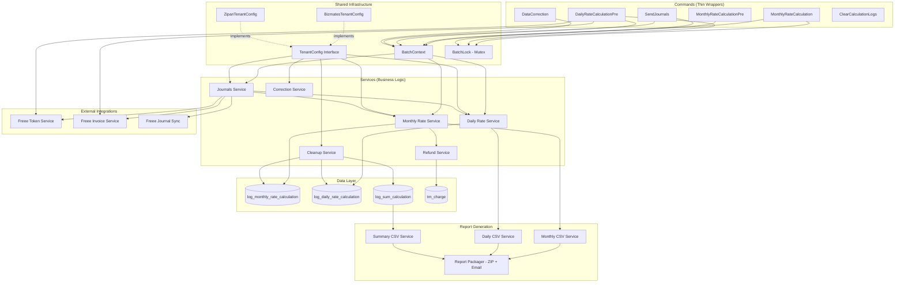
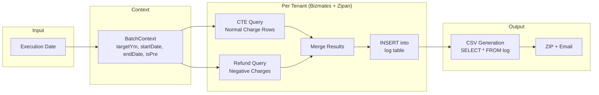
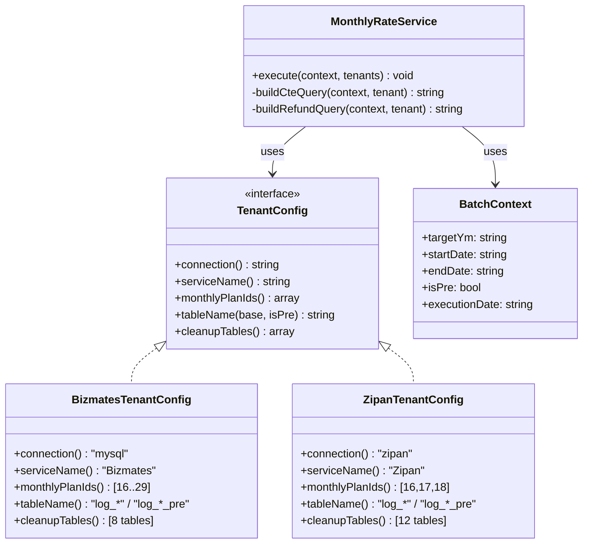
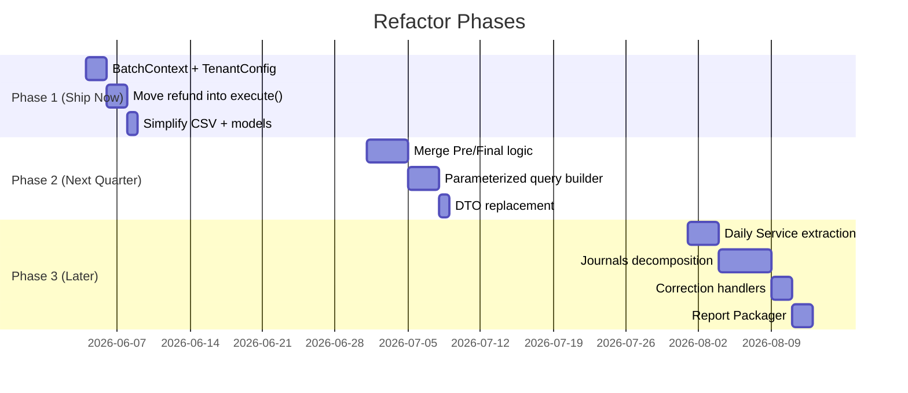

# Accounting System — Target Architecture

## System Overview

## Data Flow — Monthly Batch

## Tenant Strategy Pattern

## Implementation Phases

---

## How to Render

1. **VS Code**: Install "Markdown Preview Mermaid Support" extension → Open this file → Ctrl+Shift+V
2. **Online**: Copy any mermaid block to [mermaid.live](https://mermaid.live) → Export as PNG/SVG
3. **Draw.io**: File → Import → Paste mermaid code
